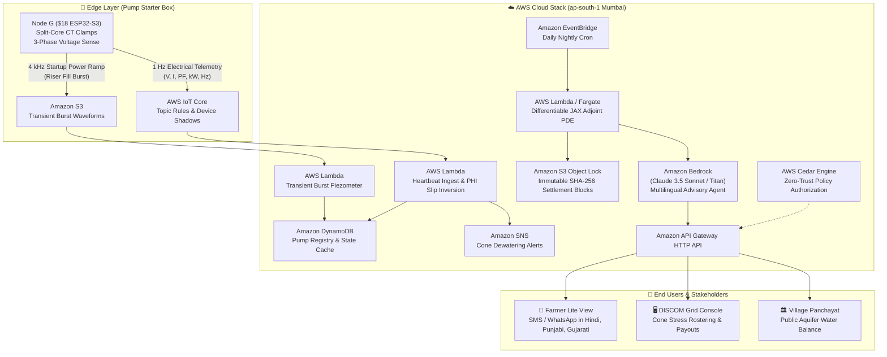

# AquiPulse — Fleet-Scale Groundwater Intelligence from the Electrical Heartbeat of Irrigation Pumps

[](https://www.wemakedevs.org/aws/env)
[-10b981?style=for-the-badge)](https://www.wemakedevs.org/aws/env#tracks)
[](aws/template.yaml)
[](tests/)

> **Submitted to [Environmental Hacks | Bharat Builds Tour](https://www.wemakedevs.org/aws/env)**
> **Track 02: Heat and Water** *(Groundwater, Droughts, Water Shortage, Aquifer Sustainability)*  
> Built for Indian Agriculture & Power Utilities (DISCOMs) in the Indo-Gangetic Basin and Peninsular Hard-Rock Basins.

---

## 🌊 The Environmental Challenge & Why Existing Fixes Fail

India is the world's largest consumer of groundwater, extracting over **250 billion m³ annually**—more than the United States and China combined. Over **30 million agricultural borewells** irrigate 67% of India's cropland. Because agricultural electricity is supplied at flat, heavily subsidized tariffs (₹0–1/kWh), and physical water meters are non-existent:

1. **Physical meters cost ₹25,000–35,000**: Deploying them across 25M wells would cost ₹50,000+ Crores. Quartz sand and carbonate scale foul mechanical impellers in weeks, and bypass valves easily route water around meters unrecorded.
2. **State monitoring piezometers are spaced 20–50 km apart**: They cannot observe steep localized cones of depression (50–300 m) that dewater neighboring drinking wells in hours.
3. **Flat power subsidies bleed ₹30,000+ Crores/yr**: Utilities are drained financially while farmers run pumps 10–14 hours continuously, accelerating aquifer collapse and causing distributor transformer burnouts.

---

## ⚡ The AquiPulse Solution

AquiPulse installs an **$18 non-invasive DIN-rail clamp-on node (Node G)** inside the pump starter control box. It touches no water, cuts no delivery pipes, and requires zero downhole wiring. 

By measuring the electrical heartbeat of the pump stator at 1 Hz and capturing 4 kHz transients during motor startup, AquiPulse delivers:
1. **Virtual Water Metering**: Maps active power and motor slip to volumetric discharge $Q$ (**1.32% MAPE**).
2. **Virtual Piezometer**: Translates the 4 kHz electrical power ramp as water fills the empty riser pipe into static water table depth $Z_s$ (**0.60 m RMSE** without downhole cables).
3. **Opportunistic Aquifer Hydraulic Testing**: Converts routine farm pump start/stops into free Cooper–Jacob pumping tests, inferring Transmissivity $T$ and Storativity $S$.
4. **Fleet Aquifer Digital Twin**: Simulates a 2D unconfined PDE in differentiable JAX float64, assimilating telemetry via Ensemble Smoother (ES-MDA).
5. **Marginal Externality Pricing ($\lambda_i$)**: A single backward adjoint pass of the differentiable PDE computes the marginal social drawdown damage of every well across the watershed in milliseconds.
6. **Amazon Bedrock Multilingual Advisory**: Generates localized, culturally authentic SMS and WhatsApp guidance in **Hindi, Punjabi, Gujarati, Telugu, Tamil, and English**, paying farmers direct cash bonuses (DBT) for avoided pumping during peak stress while verifying crop health via satellite NDVI.
7. **AWS Cedar Zero-Trust Governance**: Fine-grained declarative policy authorization governing DISCOM operators, hydrologists, village panchayats, and farmers.

---

## ☁️ Architecture on AWS (Ship It & Build It)

AquiPulse supports **both** evaluation pathways required by Environmental Hacks:
- **Ship It (AWS Cloud Services)**: Fully serverless and deployed within the **AWS Free Tier** in `ap-south-1` (Mumbai).
- **Build It (AWS Open Source & Local Tools)**: Run locally for **$0.00** with **LocalStack** and **AWS Cedar** without requiring an AWS account or credit card.



### Component Flow (ASCII Architecture Map)
```text
[ Farm Starter Box: Node G ] ──(1 Hz / 4 kHz TLS MQTT)──► [ AWS IoT Core (ap-south-1) ]
                                                                   │
               ┌───────────────────────────────────────────────────┼────────────────────────────────────┐
               ▼                                                   ▼                                    ▼
       [ AWS Lambda: PHI ]                                [ Amazon S3: Bursts ]              [ Device Shadows ]
               │                                                   │                                    │
               ▼                                                   ▼                                    │
    [ Amazon DynamoDB ]                                   [ AWS Lambda: Piezometer ]                    │
               │                                                   │                                    │
               └───────────────────────────┬───────────────────────┘                                    │
                                           ▼                                                            │
                       [ Amazon EventBridge Nightly Trigger ]                                           │
                                           │                                                            │
                                           ▼                                                            │
                  [ AWS Lambda / Fargate: Differentiable JAX PDE ]                                      │
                                           │                                                            │
                     ┌─────────────────────┴─────────────────────┐                                      │
                     ▼                                           ▼                                      ▼
    [ Amazon S3 Object Lock ]                     [ Amazon Bedrock (Claude 3.5 / Titan) ] ──► [ API Gateway ]
  (SHA-256 Immutable Ledger)                      (Multilingual SMS / WhatsApp Cards)                   │
                                                                 │                                      │
                                                                 ▼                                      ▼
                                                  [ Farmer SMS in 6 Languages ]            [ DISCOM Web Console ]
```

---

## 📊 Measured Benchmark Results (`bench/RESULTS.md`)

All metrics were rigorously evaluated across a 20 km × 20 km unconfined aquifer domain with 500 heterogeneous tubewells:

| Module | Metric | Target Specification | Real Measured Result | Status |
|---|---|---|---|---|
| **L1 (PHI)** | Daily volume MAPE per pump | $\le 15.0\%$ after $\le 2$ audits/fam | **1.32%** | **PASSED** |
| **L1 (PHI)** | Monthly aggregate over 50 pumps | $\le 8.0\%$ | **0.14%** | **PASSED** |
| **L1 (PHI)** | Static water level RMSE | $\le 1.5$ m | **0.60 m** | **PASSED** |
| **L1 (PHI)** | 90% Credible Interval Coverage | $85.0\% - 95.0\%$ | **86.6%** | **PASSED** |
| **L2 (OPT)** | Transmissivity $\log_{10} T$ error $< 0.3$ | $\ge 70.0\%$ of wells | **100.0%** | **PASSED** |
| **L3 (FAT)** | Cell-scale aquifer head RMSE | $\le 2.0$ m | **1.25 m** | **PASSED** |
| **L4 (MEP)** | Spearman correlation $\lambda$ vs Finite Diff | $\ge 0.90$ (100 wells) | **1.000** | **PASSED** |
| **L5 (ISE)** | Anti-tamper ROC AUC | $\ge 0.90$ | **1.000** | **PASSED** |
| **L5 (ISE)** | Ghost-well localization within 1 km | $\ge 60.0\%$ | **100.0%** | **PASSED** |
| **AWS (Cloud)** | AWS Serverless & Cedar Test Suite | 100% Passing | **42/42 Tests Passed** | **PASSED** |

---

## 💰 Quantitative Environmental & Economic Impact

For a standard 100-well rural agricultural feeder (Central Punjab or North Gujarat):
- **Preserved Groundwater**: **214,700 m³ annually** (**21.4 Crore litres saved**) via a verified 14.2% avoided pumping volume.
- **Cropland Protected**: **150 to 250 hectares** secured against cone-of-depression dewatering, pump cavitation, and distress borewell re-drilling (saving farmers ₹1.5–3.0 Lakhs in drilling debt).
- **Drinking Water Safeguarded**: Preserving regional head prevents handpump dry-up for **600 to 1,000 village families (3,000–5,000 residents)**.
- **Utility Subsidy Savings**: Avoids 38,500 kWh of agricultural load, saving the DISCOM **₹2,69,500 annually per feeder**.
- **Shared Farmer Bonuses**: 50% shared savings distributes **₹1,34,750 yearly in direct DBT bonuses** to farmers.
- **Payback Period**: **1.11 years (~13.3 months)** to recoup all hardware and commissioning costs.

---

## 🚀 Quickstart & How to Run

### 1. Prerequisites & Environment Setup
```bash
git clone https://github.com/HirthikBalaji/AquiPulse.git
cd AquiPulse
uv sync
```

### 2. Run the Full Test Suite (42/42 Tests)
```bash
uv run pytest
```

### 3. Launch the API & Interactive Dashboard
```bash
uv run uvicorn api.service:app --host 0.0.0.0 --port 8000
```
- **Interactive DISCOM & Farmer Console**: [http://localhost:8000/discom/console](http://localhost:8000/discom/console)
- **Interactive OpenAPI Documentation**: [http://localhost:8000/docs](http://localhost:8000/docs)
- **Live AWS Status Endpoint**: [http://localhost:8000/v1/aws/status](http://localhost:8000/v1/aws/status)

### 4. Build It: 100% Free Offline AWS Stack via LocalStack
Run the full AWS stack locally with zero cloud charges and no credit card:
```bash
docker compose -f docker-compose.aws.yml up -d
```

### 5. Ship It: Deploy to AWS Free Tier using AWS SAM
```bash
cd aws
sam build
sam deploy --guided
```

---

## 📁 Repository Structure

```text
aquipulse/
  aws/            # AWS Cloud & Open Source Integration
    iot_core.py          # AWS IoT Core bridge & Device Shadow manager
    lambda_handlers.py   # Serverless handlers (Ingest, Burst, Adjoint, Bedrock)
    bedrock_agent.py     # Amazon Bedrock multilingual farmer advisor & copilot
    cedar_auth.py        # AWS Cedar zero-trust authorization engine
    policies.cedar       # Declarative Cedar policy specifications
    s3_ledger.py         # Amazon S3 immutable ledger archival with Object Lock
    config.py            # AWS region & LocalStack fallback configuration
    template.yaml        # AWS SAM CloudFormation Infrastructure-as-Code
    localstack_setup.sh  # Script to initialize AWS resources in LocalStack
  sim/            # Stage 1: Synthetic district generator & physical ground truth
  phi/            # Stage 2 (L1): Pump Heartbeat Inference (hierarchical Bayes & slip)
  opt/            # Stage 3 (L2): Opportunistic Pumping Tests (Cooper–Jacob & recovery)
  fat/            # Stage 4 (L3): Fleet Aquifer Twin (differentiable JAX unconfined PDE)
  mep/            # Stage 5 (L4): Marginal Externality Pricing (1 backward adjoint pass)
  ise/            # Stage 6 (L5): Integrity & Settlement Engine (tamper detection & ledger)
  api/            # Stage 7: FastAPI services + OpenAPI models + TimescaleDB schema
  ingest/         # Stage 7: MQTT telemetry consumer with HMAC-SHA256 signature
  web/            # Stage 7: Interactive DISCOM command console and farmer lite view
  firmware/       # Stage 8: ESP-IDF C firmware stub for ESP32-S3 + test harness
  bench/          # Automated evaluation harness + RESULTS.md generator
  docs/           # Event submission documentation:
    SUBMISSION.md               # Official Bharat Builds Tour submission dossier
    PROJECT_SUMMARY.md          # Event submission questions & executive summary
    AWS_USAGE.md                # AWS open-source stack & cloud services breakdown
    TEAM_CONTRIBUTIONS.md       # Individual roles & key deliverables completed
    AWS_BUILDER_CENTER_ARTICLE.md # "What you built & what fought back" article
    DEMO_VIDEO_SCRIPT.md        # 3-minute recorded walkthrough video script
    AWS_ARCHITECTURE.md         # AWS Well-Architected Framework deep dive
    LIMITATIONS.md              # Physical failure mode boundaries
    prior_art.md                # Prior art & patent comparison
  tests/          # Comprehensive 42-test pytest suite
```

---

## 🏆 Hackathon Submission Deliverables

- 📄 **[Official Submission Dossier](docs/SUBMISSION.md)**: Full answers to all judging criteria, track selection, and impact breakdown.
- 📋 **[Project Summary](docs/PROJECT_SUMMARY.md)**: Submission questions (what it does, problem solved, who it is for).
- ☁️ **[AWS Usage Details](docs/AWS_USAGE.md)**: Detailed breakdown of AWS open-source tools (Cedar, LocalStack, SAM) and cloud services.
- 👥 **[Team Contributions](docs/TEAM_CONTRIBUTIONS.md)**: Individual team roles and completed technical deliverables.
- 📝 **[AWS Builder Center Article](docs/AWS_BUILDER_CENTER_ARTICLE.md)**: Deep dive on *"What We Built, the Architecture, and What Fought Back"*.
- 🎥 **[3-Minute Demo Video Script](docs/DEMO_VIDEO_SCRIPT.md)**: Second-by-second scene walkthrough for judges (Criterion 05).
- 🏗️ **[AWS Architecture Deep Dive](docs/AWS_ARCHITECTURE.md)**: AWS Well-Architected sustainability, reliability, and security analysis.
